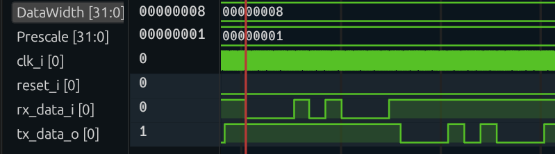
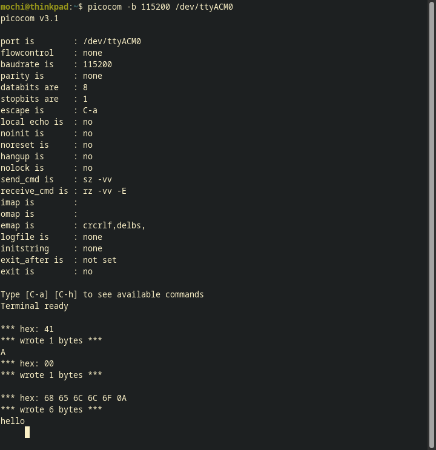

# verilog-UART-ALU
[GitHub](https://github.com/MochiButter/verilog-UART-ALU/)

## Step 1 - UART echo
Task: Instantiate the `uart_rx` and `uart_tx` module inside `rtl/uart_echo.sv` to send back bytes that were sent to the FPGA.

I started by creating a uart_echo module with a testbench to go with it.
The testbench has tasks for sending and verifying the received bits, which delays based on the `Prescale` parameter.
In hindsight, I should have instantiated the `uart_rx` and `uart_tx` modules and checked the data registers there instead.
I verified that the module was echoing back the rx inputs to the tx output in the testbench and waveform shown in Figure \ref{uart_sim}.

I then made the top module for the 
[icesugar](https://github.com/wuxx/icesugar)
board.
I tested the top module after synthesizing the netlist, making sure that the results match with the behavioral model.
The testbench was modified with defines to modify the setup for behavioral simulation, gate level simulation, and post-synth gate level simulation for the `top` module.
One error that I was stuck up on was that I somehow mixed up the pins that are available on the PLL for the output clock;
I assigned the clk generator to `PLLOUTCORE` and used `PLLOUTGLOBAL` as the clock in the `top` module.
This made the tests fail and the bitstream to respond back in complete silence when testing on the board.
After that was fixed, the tests passed and the module properly echoed back the bytes, shown in Figure \ref{top_gls}.

Finally, testing on the FPGA connected via USB resulted in the expected behavior, as shown in Figure \ref{picocom}.

Throughout the work done for this section, I made various modification to the build system to fix any errors that came up:

- In the `icesugar.tcl` file, `ice40_opt` was causing the synthesis to fail. I commented this out.
- In `make lint`, the icestorm sim files were causing syntax errors. I added `-DNO_ICE40_DEFAULT_ASSIGNMENTS` to verilator calls to bypass this.
- Both yosys and nextpnr now print to logs instead of stdout.
