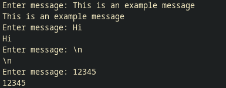
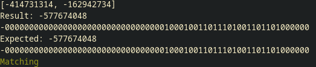

# verilog-UART-ALU
[GitHub](https://github.com/MochiButter/verilog-UART-ALU/)

## Step 1 - UART echo
Task: Instantiate the `uart_rx` and `uart_tx` module inside `rtl/uart_echo.sv` to send back bytes that were sent to the FPGA.

I started by creating a uart_echo module with a testbench to go with it.
The testbench has tasks for sending and verifying the received bits, which delays based on the `Prescale` parameter.
In hindsight, I should have instantiated the `uart_rx` and `uart_tx` modules and checked the data registers there instead.
I verified that the module was echoing back the rx inputs to the tx output in the testbench and waveform shown in Figure \ref{uart_sim}.

I then made the top module for the 
[icesugar](https://github.com/wuxx/icesugar)
board.
I tested the top module after synthesizing the netlist, making sure that the results match with the behavioral model.
The testbench was modified with defines to modify the setup for behavioral simulation, gate level simulation, and post-synth gate level simulation for the `top` module.
One error that I was stuck up on was that I somehow mixed up the pins that are available on the PLL for the output clock;
I assigned the clk generator to `PLLOUTCORE` and used `PLLOUTGLOBAL` as the clock in the `top` module.
This made the tests fail and the bitstream to respond back in complete silence when testing on the board.
After that was fixed, the tests passed and the module properly echoed back the bytes, shown in Figure \ref{top_gls}.

Finally, testing on the FPGA connected via USB resulted in the expected behavior, as shown in Figure \ref{picocom}.

Throughout the work done for this section, I made various modification to the build system to fix any errors that came up:

- In the `icesugar.tcl` file, `ice40_opt` was causing the synthesis to fail. I commented this out.
- In `make lint`, the icestorm sim files were causing syntax errors. I added `-DNO_ICE40_DEFAULT_ASSIGNMENTS` to verilator calls to bypass this.
- Both yosys and nextpnr now print to logs instead of stdout.

## Step 2 - Python serial packets
I had trouble writing and reading bytes using pyserial, while picocom worked flawlessly.

Issues with using picocom:

- Picocom required all bytes sent to be in `bytearray` types. I was using `write(0xec)` which is different from `write(b'\xec')` I'm not sure why the first did not give me an error.
- Using the `threading.Thread` to call `read(1)` gave me errors when using it together with `time.sleep()`. Using pyserial's own threaded reader fixed this.

An example of sending bytes to be echoed (Using ascii messages here) and doing addition, shown in Figure \ref{echo_py} and \ref{add_py}:

## Step 3 - Sending packets
Here's the definitions of the commands that I decided for the uart_alu module.

| Function | Opcode | Length requirements               | Response (bytes)                 |
| -------- | ------ | --------------------------------- | -------------------------------- |
| Echo     | `0xec` | > `0x4`                           | Same as data bytes               |
| Add      | `0xad` | >= `0xc`, must be a multiple of 4 | `0x4` (No carry)                 |
| Mul      | `0x63` | >= `0xc`, must be a multiple of 4 | `0x4` (Lower 32 of the product)  |
| Div      | `0x5b` | == `0xc`                          | `0x8` (Quotient, then Remainder) |

I chose these opcdes because they use unique bytes.
I had difficulty deciding on what kind of response the uart should have, like sending carry bits, the product, etc.

## Step 4 - State machine RTL
I created the state machine to receive and send bytes in two parts.
I made the `uart_alu` module to take four bytes to make sure opcodes and lengths are valid.
I tested the echo command to make sure that this part works.
I then made the `alu32` module that has a ready valid interface to take an opcode and operands, to make sure that the arithmetic was working properly.
The rest of the opcodes loads 64 bits into a register first, then waits for the alu to give a valid_o.
Subsequent operands are loaded into the B register and the previous result is loaded into the A register.

I had trouble here making sure that each state is transitioning properly.
I originally had the testbench send bytes without stop, but changing it to take breaks in between sends helped me find a bug with the states.
In the real world bytes won't be sent perfectly on time.

The post-synthesis simulation for the ice40 took me 39 minutes to do 1000 random commands.
My approach to the fuzz test was to select a random number of operands, and each operand was randomized.

After making sure that the module works with its testbench, I moved onto adding states for the rest of the opcodes.
